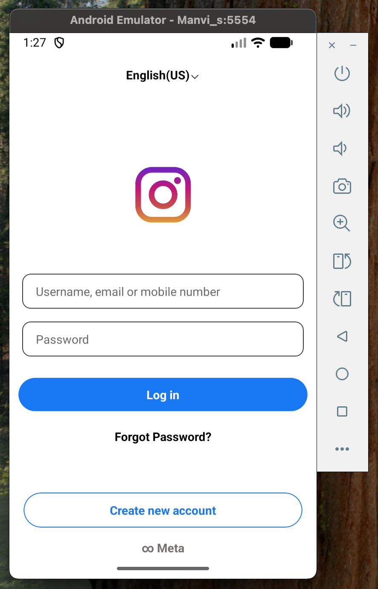
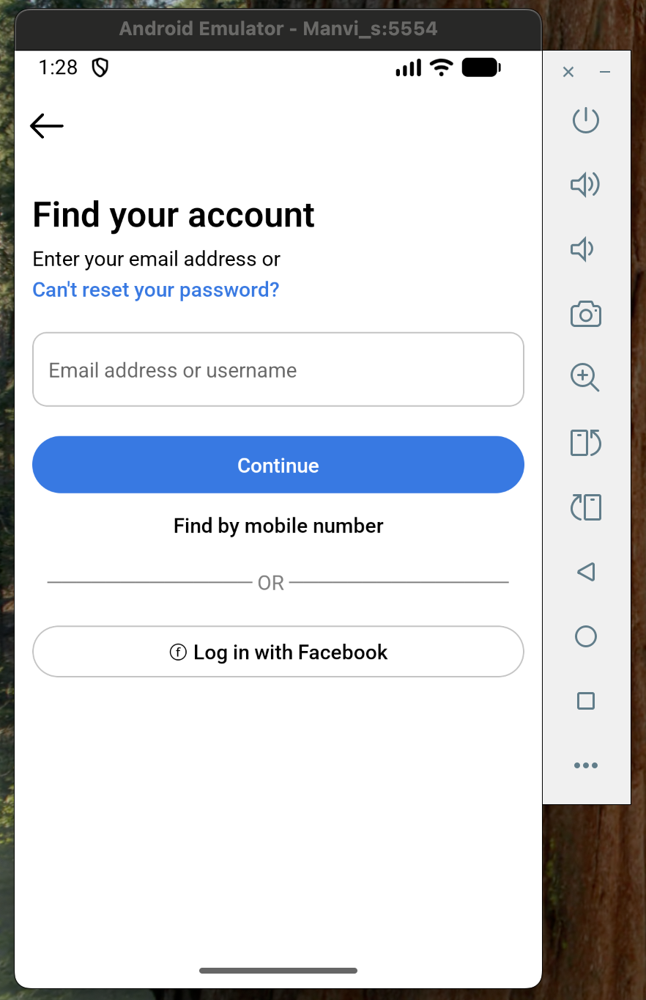
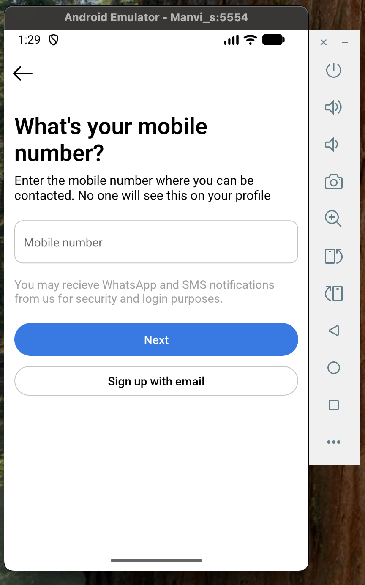

# Instagram Clone 📸

An Instagram-inspired mobile application built using **Expo (React Native)**.
This project focuses on recreating the core UI and basic user flow of Instagram.

## 🚀 Features
- Login and Create Account screens
- Home feed UI
- Custom Instagram-style header
- Reusable UI components
- Image-based layout similar to Instagram

## 🛠 Tech Stack
- Expo
- React Native
- JavaScript (JSX)
- StyleSheet (CSS)

## 📚 What I Learned
- Building multi-screen apps using Expo
- Creating reusable components in React Native
- Working with layouts, images, and UI styling
- Structuring a real-world mobile application

## 📂 Project Status
Frontend/UI focused learning project.

## 📸 App Screenshots

---
Made with ❤️ by Manvi
